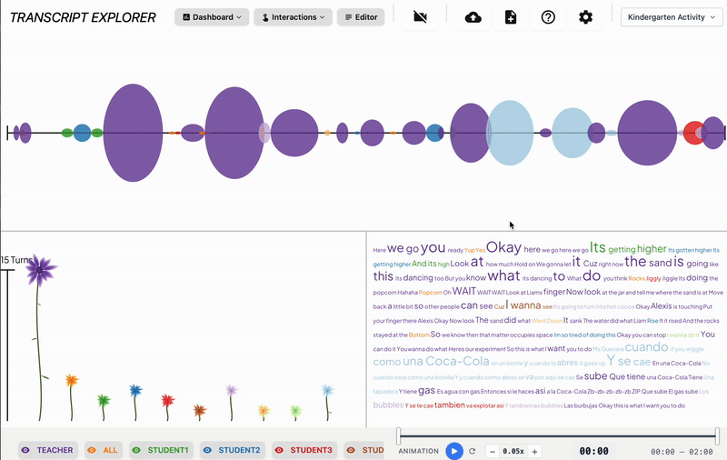
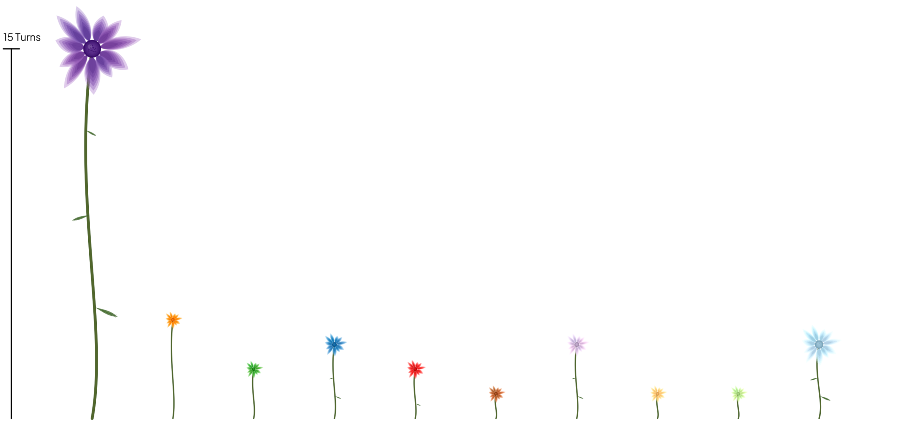
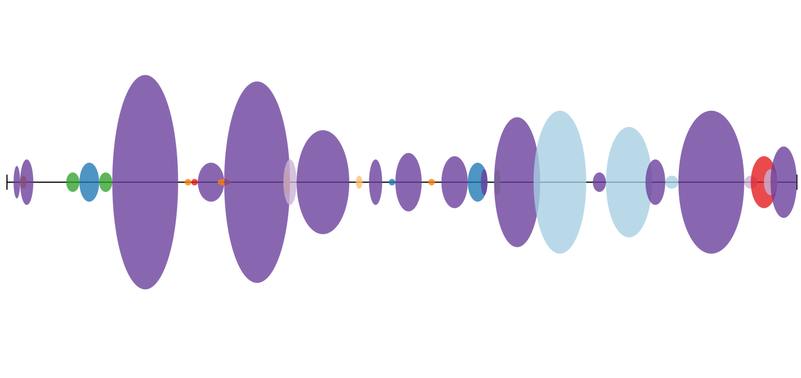
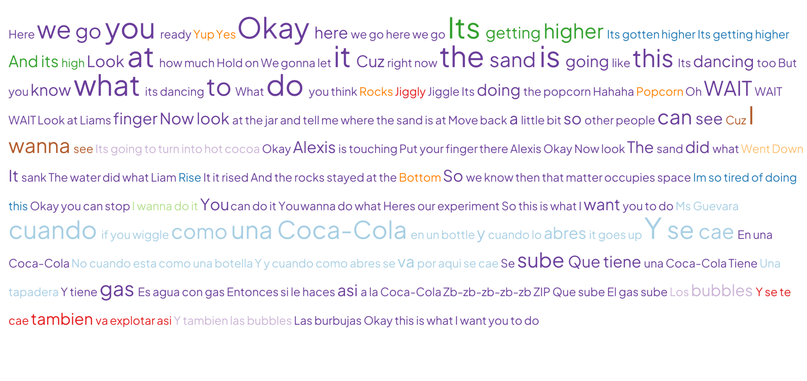
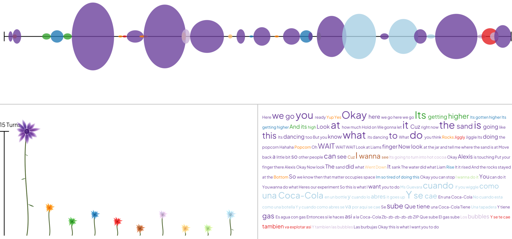

<h1 align="center">Transcript Explorer</h1>

<p align="center">
  <strong>An open-source tool for dynamically visualizing and exploring transcripts of conversation linked to video</strong>
</p>

<p align="center">
  <a href="https://www.transcriptexplorer.org"></a>
</p>

<p align="center">
  <a href="https://www.gnu.org/licenses/gpl-3.0"></a>
  
  
  
  
</p>

<p align="center">
  
</p>

---

> **Your data stays on your device.** No transcripts or videos are uploaded, stored, or transmitted—all processing happens entirely in your browser.

---

## Features

- **Browser-Based** — Everything runs locally in your browser with zero server dependencies
- **Multiple Visualizations** — Distribution diagram, turn chart, contribution cloud, and flower mode
- **Video Integration** — Sync transcripts with YouTube videos or local video files
- **Auto-Transcription** — In-browser Whisper AI transcription (no data leaves your device)
- **Interactive Editor** — Edit transcripts with inline timing controls and video sync
- **Export Options** — Export edited transcripts as CSV

---

## Visualizations

Transcript Explorer provides four visualization modes to explore your conversation data.

> _Screenshots show example transcript data from a 2-minute kindergarten classroom activity._

|                                                                                                                                                                                      |                                                                                                                                                                |
| :----------------------------------------------------------------------------------------------------------------------------------------------------------------------------------: | :------------------------------------------------------------------------------------------------------------------------------------------------------------: |
|                                                                                                                     |                                                                                                                   |
|                                                                               **Distribution Diagram**                                                                               |                                                                         **Turn Chart**                                                                         |
| Each flower represents a speaker. Flower size indicates words spoken; height indicates number of turns. Hover to see the first word of each turn; click to watch video of each turn. | Each ellipse is a conversation turn, colored by speaker. Width indicates turn duration; height indicates word count. Hover to read turns; click to play video. |

|                                                                                                                                                        |                                                             |
| :----------------------------------------------------------------------------------------------------------------------------------------------------: | :---------------------------------------------------------: |
|                                                                                           |                  |
|                                                                 **Contribution Cloud**                                                                 |                        **Dashboard**                        |
| Turns displayed as a paragraph as they unfold. When a word is repeated, its first instance grows in size. Click any word to play video from that turn. | Coordinated view showing all visualizations simultaneously. |

---

## Quick Start

1. **Visit** [transcriptexplorer.org](https://www.transcriptexplorer.org)
2. **Upload** a transcript (CSV/TXT) or select an example dataset
3. **Explore** visualizations and optionally link a video

---

## Data Format

Transcript files should be CSV or TXT with the following structure:

| Column    | Required | Description                      |
| --------- | :------: | -------------------------------- |
| `speaker` |   Yes    | Speaker name or identifier       |
| `content` |   Yes    | Transcript text content          |
| `start`   |    No    | Start time (seconds or HH:MM:SS) |
| `end`     |    No    | End time (seconds or HH:MM:SS)   |

**Example:**

```csv
speaker,content,start,end
SPEAKER 1,Hello everyone,0:00:05,0:00:07
SPEAKER 2,Hi there!,0:00:08,0:00:09
```

You can also load:
- **Video** (MP4, YouTube URL) synced to timeline
- **Auto-transcribe** video files directly in the browser

[Download Data Formatting Guide (PDF)](./static/images/data_formatting_guide.pdf)

---

## Developer Setup

### Prerequisites

- Node.js 18+
- Yarn

### Installation

```bash
# Clone the repository
git clone https://github.com/BenRydal/transcript-explorer.git
cd transcript-explorer

# Install dependencies
yarn install

# Start development server
yarn dev
```

Visit `http://localhost:5173` in your browser.

### Available Scripts

| Command        | Description                  |
| -------------- | ---------------------------- |
| `yarn dev`     | Start development server     |
| `yarn build`   | Production build             |
| `yarn preview` | Preview production build     |
| `yarn check`   | Type-check with svelte-check |
| `yarn lint`    | Run Prettier and ESLint      |
| `yarn format`  | Auto-format with Prettier    |

---

## Tech Stack

| Category       | Technology                                                                 |
| -------------- | -------------------------------------------------------------------------- |
| Framework      | [SvelteKit](https://kit.svelte.dev/)                                       |
| Language       | [TypeScript](https://www.typescriptlang.org/)                              |
| Visualizations | [p5.js](https://p5js.org/)                                                 |
| Styling        | [Tailwind CSS](https://tailwindcss.com/) + [DaisyUI](https://daisyui.com/) |
| CSV Parsing    | [Papa Parse](https://www.papaparse.com/)                                   |
| Transcription  | [Whisper](https://github.com/xenova/transformers.js) (via Transformers.js) |
| Time Handling  | [Luxon](https://moment.github.io/luxon/)                                   |

---

## Contributing

We welcome contributions! Here's how you can help:

1. **Report bugs** or **request features** via [GitHub Issues](https://github.com/BenRydal/transcript-explorer/issues)
2. **Submit pull requests** — for major changes, please open an issue first to discuss your proposal
3. **Share feedback** via our [feedback form](https://forms.gle/MKdfgfAnVs8uNqPg6)

---

## Credits

**Developed by:** Ben Rydal Shapiro, Edwin Zhao, and contributors

**Supported by:** This project was generously supported by the National Science Foundation

**Collaborators:** Special thanks to Rogers Hall, David Owens, Christine Hsieh, Lani Horn, Brette Garner, Lizi Metts, and the TAU and SLaM research groups for feedback and discussions supporting this work

**Data Sources:**

- Classroom discussion example data from _Mathematics Teaching and Learning to Teach (MTLT)_, University of Michigan (2010)
- Classroom science lesson data from _The Third International Mathematics and Science Study (TIMSS) 1999 Video Study_

---

## License

This project is licensed under the [GNU General Public License v3.0](https://www.gnu.org/licenses/gpl-3.0).

---

<p align="center">
  <a href="https://www.transcriptexplorer.org">Launch Transcript Explorer</a> ·
  <a href="https://github.com/BenRydal/transcript-explorer/issues">Report Issue</a> ·
  <a href="https://forms.gle/MKdfgfAnVs8uNqPg6">Give Feedback</a>
</p>
