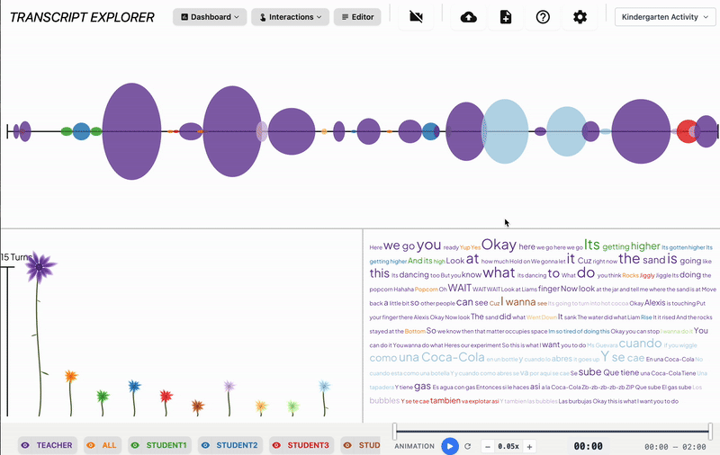
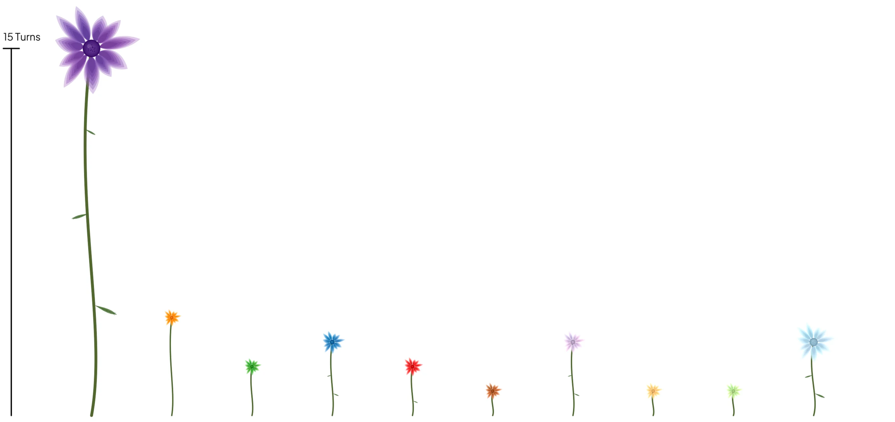
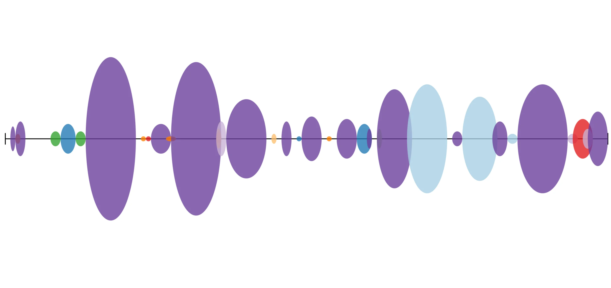
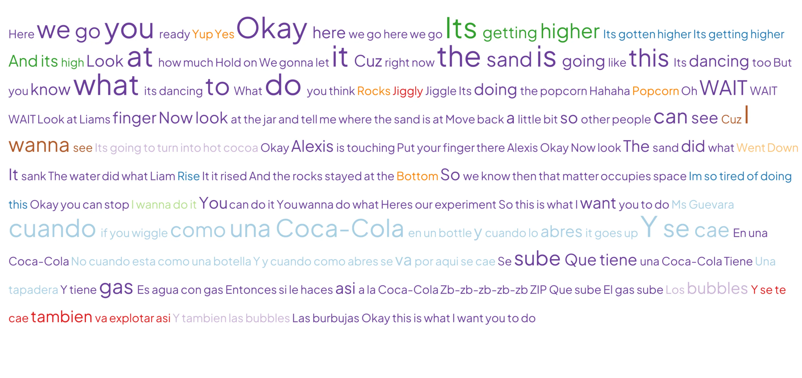
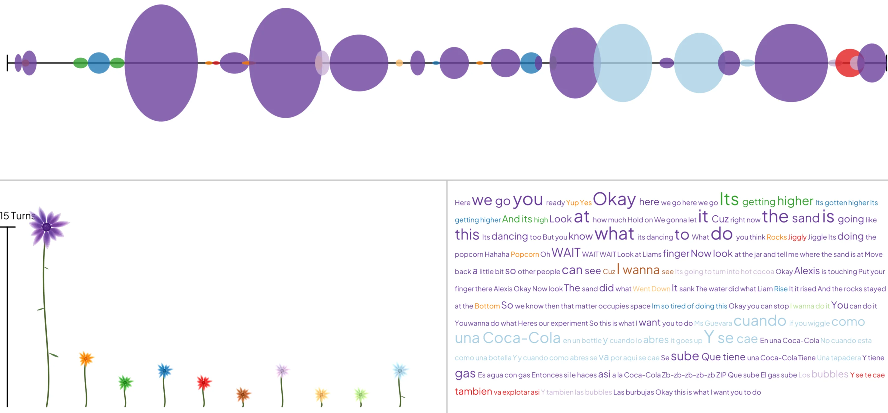

<h1 align="center">Transcript Explorer</h1>

<p align="center">
  <strong>Visualize, explore, and create transcripts linked to video</strong>
</p>

<p align="center">
  <a href="https://www.transcriptexplorer.org"></a>
  <a href="https://www.gnu.org/licenses/gpl-3.0"></a>
  
  
  
  
</p>

<p align="center">
  
</p>

---

> **Your data stays on your device.** No transcripts or videos are uploaded, stored, or transmitted—all processing happens entirely in your browser.

---

## Features

- **Browser-Based** — Everything runs locally in your browser with zero server dependencies
- **Multiple Visualizations** — Speaker garden, turn chart, contribution cloud, word rain, and more
- **Video Integration** — Sync transcripts with YouTube videos or local video files
- **Auto-Transcription** — In-browser Whisper AI transcription (no data leaves your device)
- **Transcribe Mode** — Dedicated workspace with keyboard shortcuts for manual video transcription
- **Interactive Editor** — Edit transcripts with inline timing controls, video sync, and undo/redo
- **Auto-Save** — Work is automatically saved to prevent data loss
- **Export Options** — Export edited transcripts as CSV

---

## Visualizations

Transcript Explorer provides eight visualization modes plus a configurable dashboard. Each visualization includes an interactive legend explaining its visual encodings.

- **Speaker Garden** — Flowers represent speakers; size shows words spoken, height shows turns taken
- **Turn Chart** — Ellipses show individual turns; width is duration, height is word count
- **Contribution Cloud** — Words in transcript order, sized by frequency
- **Word Rain** — Aggregated words positioned by mean time with frequency bars
- **Speaker Heatmap** — Grid of speaker activity over time bins
- **Turn Network** — Directed graph of speaker-to-speaker transitions
- **Turn Length Distribution** — Stacked histogram of turn lengths by speaker
- **Dashboard** — Configurable multi-panel view combining any of the above

> _Screenshots show example transcript data from a 2-minute kindergarten classroom activity._

|          |  |
| :-------------------------------------------------------------------------: | :---------------------------------------------------------: |
|                             **Speaker Garden**                              |                       **Turn Chart**                        |
|  |    |
|                           **Contribution Cloud**                            |                        **Dashboard**                        |

---

## Quick Start

1. **Visit** [transcriptexplorer.org](https://www.transcriptexplorer.org)
2. **Upload** a transcript (CSV/TXT) or select an example dataset
3. **Explore** visualizations and optionally link a video

---

## Data Format

Transcript files should be CSV or TXT with the following structure:

| Column    | Required | Description                      |
| --------- | :------: | -------------------------------- |
| `speaker` |   Yes    | Speaker name or identifier       |
| `content` |   Yes    | Transcript text content          |
| `start`   |    No    | Start time (seconds or HH:MM:SS) |
| `end`     |    No    | End time (seconds or HH:MM:SS)   |

**Example:**

```csv
speaker,content,start,end
SPEAKER 1,Hello everyone,0:00:05,0:00:07
SPEAKER 2,Hi there!,0:00:08,0:00:09
```

You can also load:

- **Video** (MP4, YouTube URL) synced to timeline
- **Auto-transcribe** video files directly in the browser

---

## Developer Setup

### Prerequisites

- Node.js 20+ (a `.nvmrc` pins the version; run `nvm use` if you use nvm)
- [Corepack](https://nodejs.org/api/corepack.html) (ships with Node) — activates the pinned Yarn version automatically

### Installation

```bash
# Clone the repository
git clone https://github.com/BenRydal/transcript-explorer.git
cd transcript-explorer

# Activate the pinned Yarn (4.5.3) via Corepack
corepack enable

# Install dependencies
yarn install

# Start development server
yarn dev
```

Visit `http://localhost:5173` in your browser.

### Running the `refactor/svelte-p5-library-adoption` branch

This branch consumes the in-progress [`svelte-p5`](https://github.com/edw1nzhao/svelte-p5)
canvas-UI component library directly from preview builds (via
[pkg.pr.new](https://pkg.pr.new/)), so you do **not** need a local checkout of the
library to run it:

```bash
git clone https://github.com/BenRydal/transcript-explorer.git
cd transcript-explorer
git checkout refactor/svelte-p5-library-adoption
corepack enable
yarn install   # pulls svelte-p5* from pkg.pr.new (PR #52 of the library repo)
yarn dev
```

The three `svelte-p5*` dependencies in `package.json` point at
`https://pkg.pr.new/svelte-p5*@52` — the preview tarballs published by CI for the
library's open PR. When the library work is released to npm, these will switch to
normal version ranges. A peer-dependency warning about `svelte-p5` during install is
expected (a `workspace:` protocol artifact in the preview tarballs) and is harmless.

### Available Scripts

| Command        | Description                  |
| -------------- | ---------------------------- |
| `yarn dev`     | Start development server     |
| `yarn build`   | Production build             |
| `yarn preview` | Preview production build     |
| `yarn check`   | Type-check with svelte-check |
| `yarn lint`    | Run Prettier and ESLint      |
| `yarn format`  | Auto-format with Prettier    |

---

## Tech Stack

| Category       | Technology                                                                 |
| -------------- | -------------------------------------------------------------------------- |
| Framework      | [SvelteKit](https://kit.svelte.dev/)                                       |
| Language       | [TypeScript](https://www.typescriptlang.org/)                              |
| Visualizations | [p5.js](https://p5js.org/)                                                 |
| Styling        | [Tailwind CSS](https://tailwindcss.com/) + [DaisyUI](https://daisyui.com/) |
| CSV Parsing    | [Papa Parse](https://www.papaparse.com/)                                   |
| Transcription  | [Whisper](https://github.com/xenova/transformers.js) (via Transformers.js) |
| Time Handling  | [Luxon](https://moment.github.io/luxon/)                                   |

---

## Contributing

We welcome contributions! Here's how you can help:

1. **Report bugs** or **request features** via [GitHub Issues](https://github.com/BenRydal/transcript-explorer/issues)
2. **Submit pull requests** — for major changes, please open an issue first to discuss your proposal
3. **Share feedback** via our [feedback form](https://forms.gle/MKdfgfAnVs8uNqPg6)

---

## Citation

If you use Transcript Explorer in your research, please cite:

> Shapiro, B. R., Hall, R., Mathur, A., & Zhao, E. (2025). Exploratory Visual Analysis of Transcripts for Interaction Analysis in Human-Computer Interaction. In _Proceedings of the 2025 CHI Conference on Human Factors in Computing Systems_ (CHI '25). ACM, 17 pages. https://doi.org/10.1145/3706598.3713490

<details>
<summary>BibTeX</summary>

```bibtex
@inproceedings{10.1145/3706598.3713490,
  author = {Shapiro, Ben Rydal and Hall, Rogers and Mathur, Arpit and Zhao, Edwin},
  title = {Exploratory Visual Analysis of Transcripts for Interaction Analysis in Human-Computer Interaction},
  year = {2025},
  isbn = {9798400713941},
  publisher = {Association for Computing Machinery},
  address = {New York, NY, USA},
  doi = {10.1145/3706598.3713490},
  booktitle = {Proceedings of the 2025 CHI Conference on Human Factors in Computing Systems},
  articleno = {678},
  numpages = {17},
  series = {CHI '25}
}
```

</details>

---

## Credits

**Developed by:** Ben Rydal Shapiro, Edwin Zhao, and contributors

**Supported by:** This project was generously supported by the National Science Foundation

**Collaborators:** Special thanks to Rogers Hall, David Owens, Christine Hsieh, Lani Horn, Brette Garner, Lizi Metts, and the TAU and SLaM research groups for feedback and discussions supporting this work

**Data Sources:**

- Classroom discussion example data from _Mathematics Teaching and Learning to Teach (MTLT)_, University of Michigan (2010)
- Classroom science lesson data from _The Third International Mathematics and Science Study (TIMSS) 1999 Video Study_

---

## License

This project is licensed under the [GNU General Public License v3.0](https://www.gnu.org/licenses/gpl-3.0).

---

<p align="center">
  <a href="https://www.transcriptexplorer.org">Launch Transcript Explorer</a> ·
  <a href="https://github.com/BenRydal/transcript-explorer/issues">Report Issue</a> ·
  <a href="https://forms.gle/MKdfgfAnVs8uNqPg6">Give Feedback</a>
</p>
