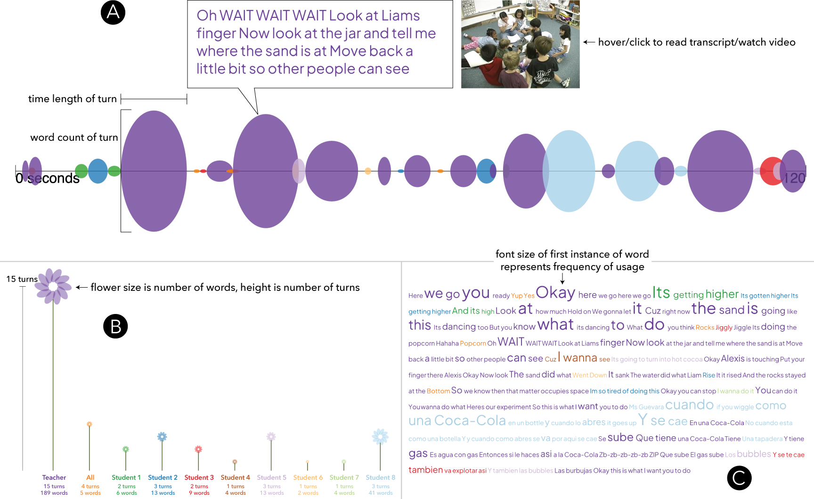

<p align="center">
  
</p>

<h1 align="center">Transcript Explorer</h1>

<p align="center">
  <strong>Visualize conversation transcripts linked to video — entirely in your browser</strong>
</p>

<p align="center">
  <a href="https://www.gnu.org/licenses/gpl-3.0"></a>
  
  
  
  
</p>

<p align="center">
  <a href="https://www.transcriptexplorer.org"><strong>Launch Transcript Explorer →</strong></a>
</p>

---

> **Your data stays on your device.** No transcripts or videos are uploaded, stored, or transmitted—all processing happens entirely in your browser.

---

## Features

- **Browser-Based** — Everything runs locally in your browser with zero server dependencies
- **Multiple Visualizations** — Distribution diagram, turn chart, contribution cloud, and flower mode
- **Video Integration** — Sync transcripts with YouTube videos or local video files
- **Auto-Transcription** — In-browser Whisper AI transcription (no data leaves your device)
- **Interactive Editor** — Edit transcripts with inline timing controls and video sync
- **Export Options** — Export edited transcripts as CSV

---

## Visualizations

Transcript Explorer provides four visualization modes to explore your conversation data:

| Distribution Diagram | Turn Chart |
|:---:|:---:|
|  |  |
| Circular view showing word distribution by speaker over time | Timeline view of conversation turns |

| Contribution Cloud | Flower Mode |
|:---:|:---:|
|  |  |
| Word cloud organized by speaker contributions | Organic visualization with stalk height = turns, flower size = words |

> **Note:** Add your screenshots to `static/images/` with the filenames above, or update the paths to match your images.

---

## Quick Start

1. **Visit** [transcriptexplorer.org](https://www.transcriptexplorer.org)
2. **Upload** a transcript (CSV/TXT) or select an example dataset
3. **Explore** visualizations and optionally link a video

---

## Data Format

Transcript files should be CSV or TXT with the following structure:

| Column | Required | Description |
|--------|:--------:|-------------|
| `speaker` | Yes | Speaker name or identifier |
| `content` | Yes | Transcript text content |
| `start` | No | Start time (seconds or HH:MM:SS) |
| `end` | No | End time (seconds or HH:MM:SS) |

**Example:**
```csv
speaker,content,start,end
SPEAKER 1,Hello everyone,0:00:05,0:00:07
SPEAKER 2,Hi there!,0:00:08,0:00:09
```

---

## Developer Setup

### Prerequisites
- Node.js 18+
- Yarn

### Installation

```bash
# Clone the repository
git clone https://github.com/BenRydal/transcript-explorer.git
cd transcript-explorer

# Install dependencies
yarn install

# Start development server
yarn dev
```

Visit `http://localhost:5173` in your browser.

### Available Scripts

| Command | Description |
|---------|-------------|
| `yarn dev` | Start development server |
| `yarn build` | Production build |
| `yarn preview` | Preview production build |
| `yarn check` | Type-check with svelte-check |
| `yarn lint` | Run Prettier and ESLint |
| `yarn format` | Auto-format with Prettier |

---

## Tech Stack

| Category | Technology |
|----------|------------|
| Framework | [SvelteKit](https://kit.svelte.dev/) |
| Language | [TypeScript](https://www.typescriptlang.org/) |
| Visualizations | [p5.js](https://p5js.org/) |
| Styling | [Tailwind CSS](https://tailwindcss.com/) + [DaisyUI](https://daisyui.com/) |
| CSV Parsing | [Papa Parse](https://www.papaparse.com/) |
| Transcription | [Whisper](https://github.com/xenova/transformers.js) (via Transformers.js) |
| Time Handling | [Luxon](https://moment.github.io/luxon/) |

---

## Contributing

We welcome contributions! Here's how you can help:

1. **Report bugs** or **request features** via [GitHub Issues](https://github.com/BenRydal/transcript-explorer/issues)
2. **Submit pull requests** — for major changes, please open an issue first to discuss your proposal
3. **Share feedback** via our [feedback form](https://forms.gle/MKdfgfAnVs8uNqPg6)

---

## Credits

**Developed by:** Ben Rydal Shapiro, Edwin Zhao, and contributors

**Supported by:** This project was generously supported by the National Science Foundation

**Collaborators:** Special thanks to Rogers Hall, David Owens, Christine Hsieh, Lani Horn, Brette Garner, Lizi Metts, and the TAU and SLaM research groups for feedback and discussions supporting this work

**Data Sources:**
- Classroom discussion example data from *Mathematics Teaching and Learning to Teach (MTLT)*, University of Michigan (2010)
- Classroom science lesson data from *The Third International Mathematics and Science Study (TIMSS) 1999 Video Study*

---

## License

This project is licensed under the [GNU General Public License v3.0](https://www.gnu.org/licenses/gpl-3.0).

---

<p align="center">
  <a href="https://www.transcriptexplorer.org">Launch Transcript Explorer</a> ·
  <a href="https://github.com/BenRydal/transcript-explorer/issues">Report Issue</a> ·
  <a href="https://forms.gle/MKdfgfAnVs8uNqPg6">Give Feedback</a>
</p>
